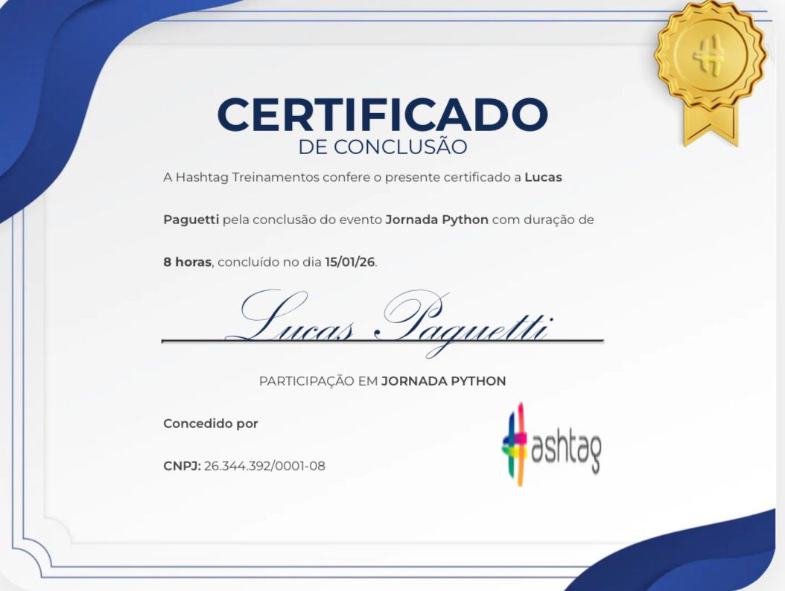

<h1 align="center">
  Jornada Python — Hashtag Treinamentos
</h1>

  
    
  
  

<h2 align="center">👨🏻‍💻 Autor deste Repositório: </h2>

<strong>Lucas Paguetti Pereira</strong> 🧙‍♂️ 
🏫 <strong>Instituição:</strong> Cesar School 🎓🧡 
📍 Recife, Pernambuco — <strong>Brazil</strong> 🇧🇷  
  

<h2 align="center">🌐 Hashtag Treinamentos: </h2>

<h2 align="center">📅 Projeto 1 — Automação de Cadastro de Produtos 
🛒🛍️</h2>

Automatiza o cadastro de produtos em um sistema web, integrando planilhas CSV e simulando ações humanas no navegador com PyAutoGUI. 🤖✅📦💻

<h3 align="center">📁 Estrutura do Projeto 1:  
</h3>
<pre>
Python Powerup - Automação Cadastro de Produtos/
├── img/
│   ├── Hashtag_logo.jpeg
│   ├── Jornada Python_logo1.jpeg
├── projeto/
│   ├── __pycache__/
│   ├── automação.py
│   ├── apoio.py
│   ├── docstring_projeto.py
│   ├── docstring_projeto.ipynb
│   ├── cores.py
├── Produtos.csv   
├── readme.md
└── license (MIT)
└── .gitignore 
</pre>

<h3 align="center">⛏️💻 Ferramentas e Tecnologias:</h3>

  

  🔗👇 Repositório: 
  <a href="https://github.com/wqiluc/Python-Powerup--Automacao--Cadastro-de-Produtos" target="_blank">
    Veja o Projeto 1 
    
  </a>

<h2 align="center">📅 Projeto 2 — Análise de Dados com Python📊📈</h2>

Análise de dados, tratamento de informações e geração de insights, utilizando planilhas e bases de dados. 🐍📊📈

<h3 align="center">📁 Estrutura do Projeto 2:  
</h3>
<pre>
Python Insights/
├── license (MIT)
├── readme.md
├── .gitignore
├── projeto/
│   ├── cancelamentos.csv
│   ├── data_analysis.ipynb
├── img/
│   ├── Hashtag_logo.jpeg
│   ├── Jornada Python_logo2.jpeg
</pre>

<h3 align="center">⛏️💻 Ferramentas e Tecnologias: </h3>

  

  🔗👇 Repositório: 
  <a href="https://github.com/wqiluc/Python-Data_Anaylis" target="_blank">
    Veja o Projeto 2 
    
  </a>

<h2 align="center">📅 Projeto 3 — Machine Learning (Python IA)🤖🧭</h2>

Criação de modelos de Inteligência Artificial e Machine Learning, utilizando bases de dados para treinamento e previsão. 🐍🤖📈

<h3 align="center">📁 Estrutura do Projeto 3:  
</h3>
<pre>
Projeto Python IA/
├── license (MIT)
├── readme.md
├── .gitignore
├── projeto/
│   ├── dados_clientes.csv
│   ├── ml_model.ipynb
├── img/
│   ├── Hashtag_logo.jpeg
│   ├── Jornada Python_logo3.jpeg
</pre>

<h3 align="center">⛏️💻 Ferramentas e Tecnologias:</h3>

  

  🔗👇 Repositório: 
  <a href="https://github.com/wqiluc/Python_AI_and-Machine-Learning" target="_blank">
    Veja o Projeto 3 
    </a>

<h2 align="center">📅 Projeto 4 — Chatbot Inteligente (Python + Streamlit + OpenAI)🤖💬</h2>

Chatbot Inteligente com interface Streamlit e integração com OpenAI.🤖💬📱

<h2 align="center">📁 Estrutura do Projeto 4:  
</h2>
<pre>
Python Dev Starlit/
│   ├── license (MIT)📜
│   ├── .gitignore
│   ├── readme.md
│   ├── 🖼️ img/
│   │   ├── Hashtag_logo.jpeg
│   │   └── Jornada Python logo4.jpeg 
│   └── 📁 projeto/
│       ├── chatbot.py
│       └── key.py
</pre>

<h3 align="center">⛏️💻 Ferramentas e Tecnologias:</h3>

  

  🔗👇 Repositório: 
  <a href="https://github.com/wqiluc/Python-Dev-Streamlit" target="_blank">
    Veja o Projeto 4
  </a>

<h2 align="center">🏆 Certificado Oficial — Jornada Python 🐍🎓</h2>

  Este certificado reconhece a conclusão da <strong>Jornada Python</strong> da <strong>Hashtag Treinamentos</strong>, 
  um workshop prático que desenvolveu habilidades em: Automação, Análise de Dados, Machine Learning e Criação de aplicações em Python.

  

